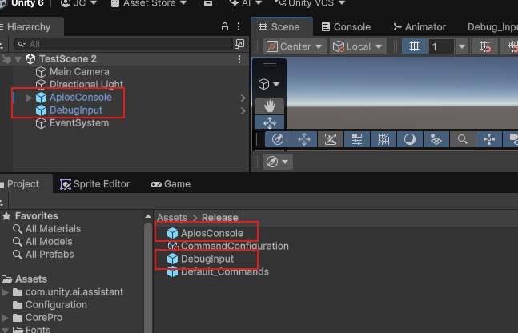

# Getting Started

New to Aplos Console? Start here.

## Adding the console to your scene

There are only two primary objects you need to get started, and both ship as prefabs in `Assets/Release`. Drag each one into your scene:

- **AplosConsole** — the console itself, complete with its own canvas. It bundles [`AplosConsole`](aplos-console.md), the console view, the [`AplosWindowManager`](aplos-window-manager.md), and the [`AplosSettingsManager`](aplos-settings-manager.md), so no further wiring is needed.
- **DebugInput** — the input object. It carries the [`AplosInputManager`](aplos-input-manager.md), a `UnityInputSystemAdapter`, the `DebugKeyboardAndMouseInputBinding` mapper for keyboard & mouse, and a [`ConsoleCursorHandler`](console-cursor-handler.md).

 
_Above: both prefabs placed in the scene, alongside the EventSystem._

Additional scene dependencies for input:

- **EventSystem** — a standard Unity GameObject (**GameObject → UI → Event System**). The console is uGUI-driven and relies on it to focus the input field and route clicks, so without one the console renders but does not respond.

### What else is in the Release folder

The other two assets are already wired up for you, but it is worth knowing what they do:

- **CommandConfiguration** — an [`AplosCommandConfiguration`](aplos-command-configuration.md) asset holding the prefabs the console needs, including its pre-loaded commands. Both prefabs above already reference it, on the [`AplosConsole`](aplos-console.md) component's `CommandConfiguration` field and the [`AplosInputManager`](aplos-input-manager.md) component's `Settings` field.
- **Default_Commands** — a sample [`AplosConsoleCommandConstructor`](aplos-console-command-constructor.md) providing a set of scene commands, such as `scene_log_performance` and `scene_freeze`. It is referenced by **CommandConfiguration**, which is how those commands reach the console at load.

## Your first command

1. Enter play mode.
2. Press the `` ` `` (backquote) key to open the console.
3. The console opens on its default list, showing only the built-in commands.
4. Type `help` and submit it to reveal every registered command, including those from **Default_Commands**.
5. Select a command and submit it — either by double-clicking its row, or by pressing the **Submit** button.

## Where to go next

- [Using the Console](using-the-console.md) — a tour of each part of the console window.
- [Adding Commands](adding-commands.md) — how to author your own commands and pre-load them.
- [Setting up Input](setting-up-input.md) — how the input components fit together, and how to support other control schemes.
- [Using the Settings](using-the-settings.md) — how to expose your own fields as tracked settings.
