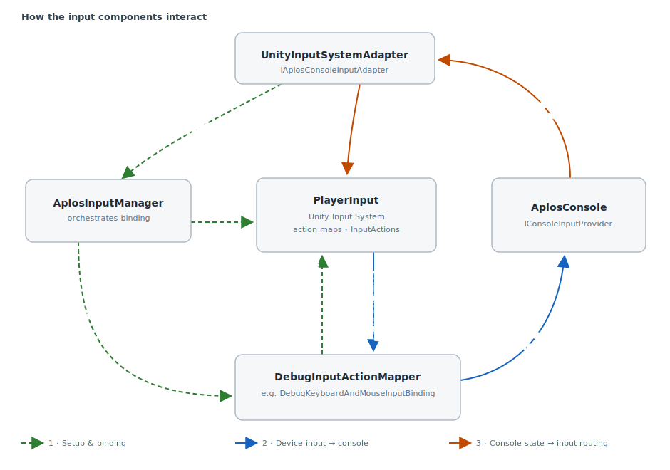
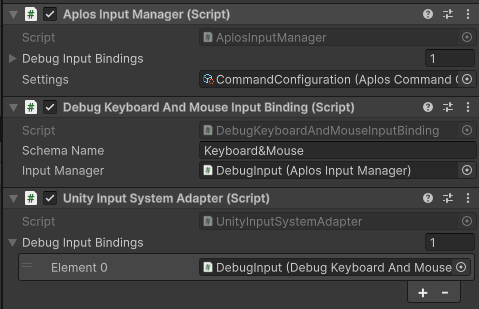
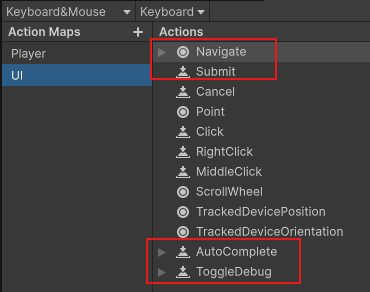

# Setting up Input

A guide to wiring device input into Aplos Console and configuring the components that drive it.

## How it works

_An overview of the input components and how they communicate with one another._

Aplos Console keeps input handling deliberately decoupled: Unity's Input System supplies the raw
actions, a thin set of Aplos components translate those actions into console calls, and the console
never needs to know which device or control scheme produced them. Four pieces do the work:

- [`AplosInputManager`](aplos-input-manager.md) — orchestrates set-up. It finds (or spawns) a
  `PlayerInput`, resolves the active control scheme, and binds the matching mapper.
- [`DebugInputActionMapper`](debug-input-action-mapper.md) — one per control scheme (the built-in
  `DebugKeyboardAndMouseInputBinding` covers keyboard & mouse). It subscribes to the relevant
  `InputAction`s and forwards each to the console.
- [`AplosConsole`](aplos-console.md) — implements [`IConsoleInputProvider`](console-interfaces.md#iconsoleinputprovider),
  the contract the mapper calls into, and raises open/close events.
- [`UnityInputSystemAdapter`](aplos-console-input-adapter-base.md) — an
  [`IAplosConsoleInputAdapter`](input-interfaces.md#iaplosconsoleinputadapter) that reacts to those
  open/close events and reroutes which input map is active.

The components communicate along three distinct flows:

1. **Set-up & binding.** On `Start`, the [`UnityInputSystemAdapter`](aplos-console-input-adapter-base.md) calls
   [`AplosInputManager.StartPlayerInput()`](aplos-input-manager.md#startplayerinput). The manager locates a `PlayerInput` in the scene — or
   instantiates the fallback `PlayerInputPrefab` when none exists — resolves the active control
   scheme, injects that `PlayerInput` into every [`DebugInputActionMapper`](debug-input-action-mapper.md), and calls `BindInput()`
   on the one whose `SchemaName` matches. That mapper subscribes its callbacks to the relevant
   `InputAction`s.

2. **Device input → console.** When the player triggers an action, the Input System fires
   `InputAction.performed`. The bound mapper's callback forwards it to the console through
   [`IConsoleInputProvider`](console-interfaces.md#iconsoleinputprovider) — `SubmitPressed`, `NavigatePressed`, `AutoCompletePressed`, or
   `ToggleDebug` — so the console reacts without any direct dependency on the input device.

3. **Console state → input routing.** When the console opens or closes it raises `OnOpenConsole` /
   `OnCloseConsole`. The [`UnityInputSystemAdapter`](aplos-console-input-adapter-base.md) listens for these and calls
   `PlayerInput.SwitchCurrentActionMap`, switching to the `"UI"` map while the console is open and
   restoring the previous gameplay map when it closes, so console typing and game controls never
   fight over the same input.

Because each seam is an interface, any part can be swapped: implement
[`IAplosConsoleInputAdapter`](input-interfaces.md#iaplosconsoleinputadapter) (or derive from
[`AplosConsoleInputAdapterBase`](aplos-console-input-adapter-base.md)) to drive a different input
system, and add a [`DebugInputActionMapper`](debug-input-action-mapper.md) per control scheme you want to support.

## Configuring Input

_How to set the input components up in a scene._

1. Add an [`AplosInputManager`](aplos-input-manager.md) component to a GameObject, and put an input adapter — the built-in
   [`UnityInputSystemAdapter`](aplos-console-input-adapter-base.md) — on the **same** GameObject. On `Awake` the manager resolves its
   adapter with [`GetComponent<IAplosConsoleInputAdapter>()`](input-interfaces.md#iaplosconsoleinputadapter), so the two must share a GameObject.
2. Add a [`DebugInputActionMapper`](debug-input-action-mapper.md) for each control scheme you support (use
   `DebugKeyboardAndMouseInputBinding` for keyboard & mouse), and list them in the manager's
   **Debug Input Bindings** field.
3. Set each mapper's `SchemaName` to exactly match a control scheme name in your Input Actions
   asset. The manager binds the mapper whose `SchemaName` matches the active scheme; if none
   matches, a warning is logged and no input is bound.
4. Assign your [`AplosCommandConfiguration`](aplos-command-configuration.md) asset to the manager's
   **Settings** field. Its `PlayerInputPrefab` is instantiated as a fallback `PlayerInput` when the
   scene has none of its own.
    
   
5. In your Input Actions asset, define the actions the console listens for — `Submit`, `Navigate`,
   `AutoComplete`, and `ToggleDebug` — and a `"UI"` action map for the console to switch to while
   its open.
    
   
6. _(Optional)_ To integrate a different input system, derive from
   [`AplosConsoleInputAdapterBase`](aplos-console-input-adapter-base.md) and implement a matching
   [`DebugInputActionMapper`](debug-input-action-mapper.md) rather than using the Unity Input System
   defaults.
7. _(Optional)_ Add a [`ConsoleCursorHandler`](console-cursor-handler.md) component to a GameObject in the scene to let the
   console manage the cursor. It listens for the console's open/close events, freeing and showing
   the cursor while the console is open and restoring the game's previous cursor state on close.
   Omit it to leave the cursor entirely under game control.
