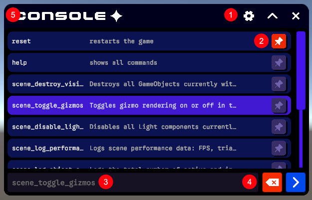
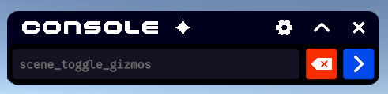

# Using the Console

A tour of the on-screen console: what each part is and how you interact with it at runtime.

## Parts of the console

The console is built from a scrollable command list, an input row with its action buttons, and a per-command pin control. The numbered callouts below correspond to the labels in the image.

### The console view

The console view is the scrollable list that fills the window. Each row is a command, showing its identifier as a header with a short description beneath it.

By default the list shows only the built-in commands (such as `help` and `reset`) together with any commands you have pinned. To reveal every registered command, run the `help` command.

Rows respond to interaction:

- **Single click** selects a row, highlighting it and dropping its command into the input field ready to run.
- **Double click** submits that command immediately.
- **Keyboard navigation** (arrow keys) steps through the visible matches, previewing the highlighted command as an inline suggestion.

### 1. Window buttons

- **Settings** opens the settings view.
- **Collapse** shrinks and expands the window; when collapsed, only the input field and action buttons remain visible.
- **Close** closes the console window.

 
_Above: the console window when collapsed._

### 2. Pinned buttons

Every command row carries its own pin button. Clicking it toggles whether that command is pinned, and the button changes colour to reflect its state.

Pinning does two things:

- **Keeps the command visible.** Pinned commands stay in the default resting list even when no search is active, so your most-used commands are always one click away.
- **Raises its priority.** Pinned commands are sorted to the top of the list, ahead of the unpinned ones.

Pins are saved to disk per console and restored the next time it opens, so your selection persists across sessions. Running a reset clears all pins and returns the list to its default ordering.

### 3. Input field

The input field is the text box where you type a command. As you type, the console filters the list and offers an inline auto-complete suggestion — the remainder of the best-matching command is shown in colour after your caret. Accepting the suggestion or selecting a row fills in the full command, and pressing submit runs it.

### 4. Action buttons

Sitting alongside the input field are two action buttons whose enabled state responds to what you have typed:

- **Submit** runs the selected command (or, if nothing is explicitly selected, the top match in the list). It becomes active only when there is a command available to run.
- **Clear** empties the input field. It becomes active whenever there is text to clear or a command ready to run.

When neither condition is met, both buttons appear disabled, so it is always obvious whether the console has something actionable.

### 5. Resizing bars

Resizing bars run along the edges of the window and let you readjust its size both vertically and horizontally. The minimum and maximum sizes the window allows can be adjusted through the settings.
