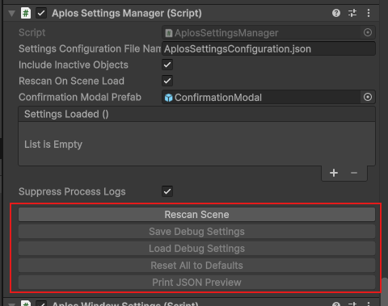
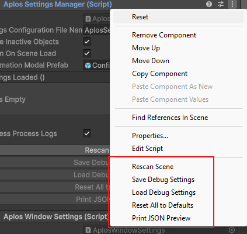

# Using the Settings / Options

How to expose a field so the settings system can track, persist, and restore it at runtime.

## Configuring a field for tracking

Aplos Console discovers settings by reflection: it scans the scene for components marked as a group, then collects the fields inside them that are marked as settings. Getting a field tracked is a matter of two attributes.

### Grouping the component

Put `[DebugGroup]` on the `MonoBehaviour` whose fields you want to expose. The group name becomes the heading its settings are filed under, both on the settings screen and in the saved JSON.

```csharp
[DebugGroup("Console UI", Description = "Console list item colors", Order = 20)]
public class AplosConsoleView : MonoBehaviour
{
    // ...
}
```

- **`GroupName`** (constructor argument) — the display name for the group. It cannot be null or empty.
- **`Description`** — optional text shown in generated documentation.
- **`Order`** — controls where the group appears; lower numbers sort earlier.

A component without any tracked fields is skipped (and logs a warning), so `[DebugGroup]` on its own does nothing until at least one field is marked.

### Marking the field

Tag each field you want tracked with `[DebugSetting]`. The scanner walks the whole inheritance chain, so fields declared on a base class are picked up too. Only **public instance fields** are collected — a private or static field is ignored even with the attribute.

```csharp
[DebugSetting(Label = "Suppress Scan/Load/Save Logs", Description = "Hide the routine scan, load and save log messages.")]
public bool SuppressProcessLogs = true;
```

Once marked, the field's value is serialized to disk on save and pushed back into the live component on load, keyed by group name and field name.

### Field options

`[DebugSetting]` takes several optional properties to refine how a field is presented and persisted:

- **`Label`** — the human-readable name for the field. Falls back to the field name if left unset.
- **`Description`** — tooltip / description text for tooling and generated docs.
- **`Min`** / **`Max`** — value hints for `int` and `float` fields. These are hints for tooling only; they are not enforced.
- **`ReadOnly`** — the field is still serialized, but flagged as non-editable in tooling.
- **`Ignore`** — excludes the field from tracking entirely, so it is neither scanned nor persisted.

## Manual operation

From the inspector, these fields can be scanned in the editor or at runtime, and saved or loaded while the game is running.


<br>
_Above: the editor buttons for manual option scanning._


<br>
_Above: the context-menu alternative to the buttons._

For more on what each of these options does, head to [`AplosSettingsManager`](aplos-settings-manager.md).

## Remarks

Nothing prevents you from declaring `[DebugGroup]` on several components with the same parameters, such as the group name. This is not treated as an error, but it is worth knowing how it resolves.

Settings are keyed by group name alone. Saving writes a block per component under that shared key, while loading matches only the first one it finds. Every component sharing the name therefore reads back that same first block, so they all end up with identical values and the rest are effectively discarded.

This is intentional for cases like runtime windows, where each spawned window shares a group and is meant to look the same. It is a trap only if you expect each instance to keep its own values — the group name is the sole identity the serializer has, so per-instance differences are not preserved.
